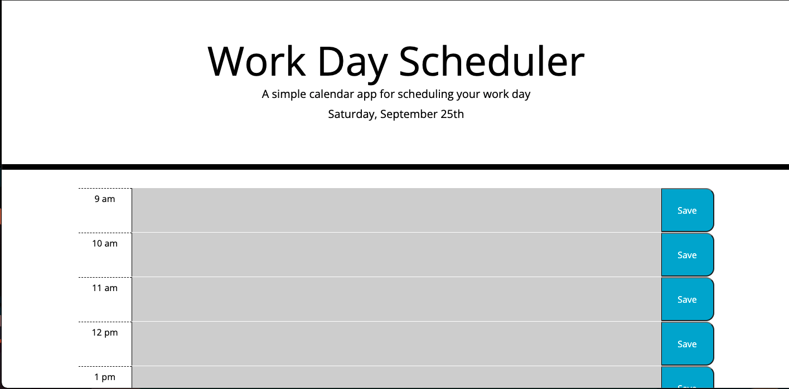

# Work Day Scheduler Starter Code

## Purpose
A deployed website where you can schedule events for the current day. The events will be available even when your refresh or 
reopen the page. All the events are colour coded to let you know which events are past due, due or in the future.

## Built With
* HTML
* CSS
* Javascript
* Third Party APIs
* Web APIs
## Website
https://samurwin.github.io/daily-planner

## Contribution
Made with ❤️ by [Samantha Urwin]